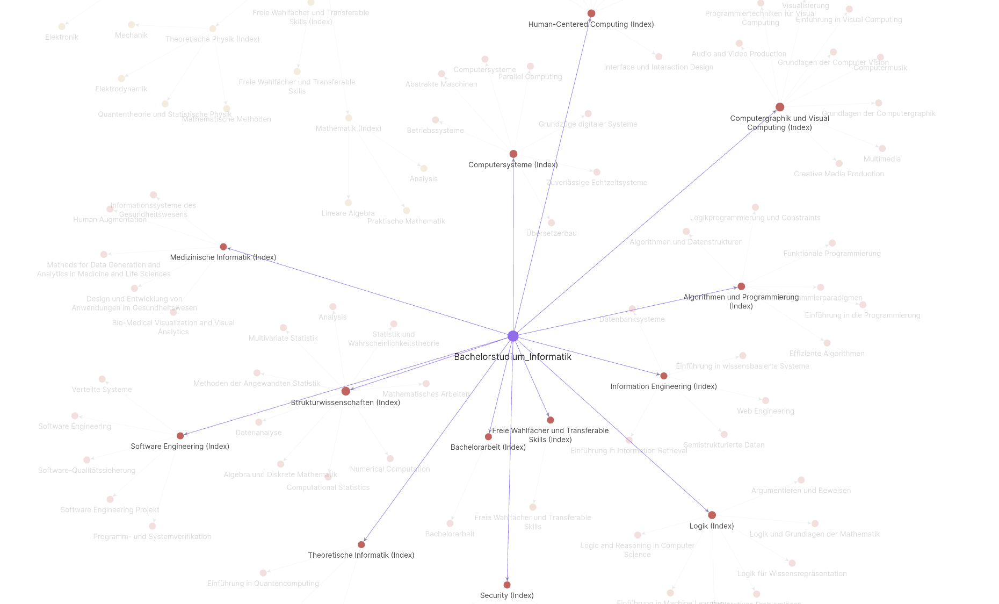

# ap2md



ap2md is a simple tool that allows you to extract the subjects and courses of your 
academic programme at the TU Wien (or any other university with few tweaks) from the
curriculum pdf into a directory structure containing Markdown documents resembling 
individual topics.

You can view that structure using Obsidian (or any other similar tool) as a graph.

## Usage
```
bash ap2md.sh <curriculum>.pdf
```

## Dependencies
Bash, pdfgrep, pdftotext
